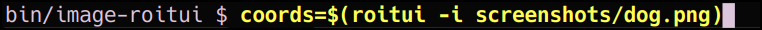
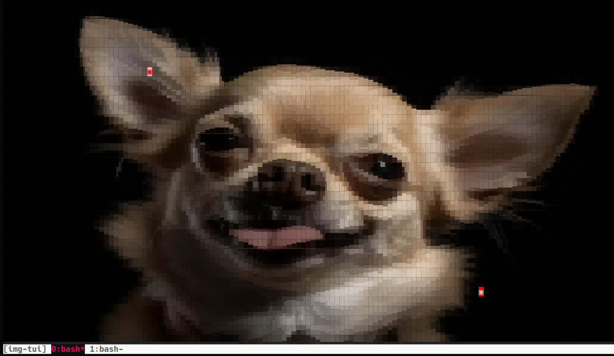
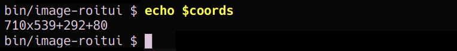

# image-roitui

### Image Region Of Interest - Text UI

**Author:** jaggz.h (contact via: [jaggz.h@gmail.com](mailto:jaggz.h@gmail.com))  
**Repository:** [https://github.com/jaggzh/image-roitui](https://github.com/jaggzh/image-roitui)  
**License:** BSD-3 (See LICENSE file in the repository)

### Overview

**image-roitui** is a text-based tool for selecting a Region Of Interest (ROI)
or a bounding box in an image using the terminal. It uses **chafa** for image
display, allowing for 24-bit RGB / full-color text-based manipulation.

*****It does NOT use sixels or anything. It's actual text (but is using chafa's 'symbols' / UTF8 support for higher "resolution" simulation.)**

After selection, it prints, to stdout, the `XxY+W+H` (eg. `300x210+50+5`), which may be captured like:
```bash
coords=$(roitui -i screenshots/dog.jpg)
```

The tool features a text UI where users can select regions using keyboard
commands, similar to `vi` (`hjkl` keys for movement). This tool is especially
useful for those who prefer working in a terminal environment or need quick
manipulations without a GUI.

### Screenshots




### Features
- Allows user selection of ROI/bounding box in a terminal.
- Uses **chafa** for rendering images in text, which supports full-color 24-bit RGB.
- Keyboard commands are inspired by `vi`, using `hjkl` for movement.

### Output from -h / --help
```
Keys:
    q/esc  - Quit
    0      - Top left
    ^      - Start of line
    $      - End of line
    G      - Bottom right corner
    hjkl   - Left, Right, Up, Down
    Space or enter mark the start and end coordinates of the selection box.

    (We do not currently support arrow keys and such, only hjkl)

    We exit immediately upon the 2nd point selected, printing:
    {width}x{height}+{coord_x}+{coord_y} to stdout
    The upper-left corner is referenced from 0,0 at the top left.
    The bottom-right corner is referenced from the terminal or image width.
    (ie. You will not be able to select a zero-width / zero-height area.)

    Example outputs:
      1. User selects a box starting at the top left corner:
           123x159+0+0
      2. User selects a box at the bottom right corner, with the same
         start/stop cursor location. (Note that 2579+13 is 2592 == the image width)
           13x40+2579+1904
```

### Limitations
- Currently does not support handling of aspect ratio, meaning images will scale to terminal width/height, even if that leads to stretching.
- Does not support arrow keys for navigation; instead, uses `hjkl` keys.
- Does not currently let the user re-set to pick a new location. When they hit enter once, it picks the first point. When they hit it again, it's done and it exits (printing the XxY+W+H).

### Dependencies
- **ffmpeg**: Required for handling video and media file formats.
- **sox**: A powerful command-line audio processor, necessary for some related functions.
- **chafa**: A terminal graphics library for converting images into text.

### Installation

To install **image-roitui**, follow these steps:

1. **Clone the repository**:
   
    ```
    bash
    git clone https://github.com/jaggzh/image-roitui.git
    ```

2. **Install dependencies**:
   Make sure you have the required dependencies installed on your system:
   
   - On **Debian-based systems** (e.g., Ubuntu):
     ```bash
     sudo apt update
     sudo apt install ffmpeg sox chafa
     ```
   
   - On **Fedora**:
     ```bash
     sudo dnf install ffmpeg sox chafa
     ```
   
   - On **macOS** (using Homebrew):
     ```bash
     brew install ffmpeg sox chafa
     ```

3. **Symlink or Copy the Script**:
   
   You can create a symlink to easily run the script from anywhere. This can be done by linking it to a directory in your `$PATH` (like `~/bin/`):
   
   ```bash
   cd ~/bin/  # Or your favorite directory in your PATH
   ln -s ~/path/to/image-roitui/roitui .
   ```
   Alternatively, you can copy the script to a directory in your `$PATH`.

### Usage

To run **image-roitui**, simply execute:

```bash
roitui -i image.jpg [other options]
```

But you most-likely want to capture the coordinates it outputs:
```bash
coords=$(roitui -i screenshots/dog.jpg)
```

If you already have something on the screen, roitui can be used without
drawing an image. You can give it a reference image for scale if you like
(without it displaying it).  Without a -i image, however, it will not
be able to use the custom cursor. (As mentioned, the custom cursor was
implemented because the rgb colors can make cursor visibility over images
difficult to see).

Use `-h` to display the help menu with available options and key bindings.

### Notes
- **Chafa Compatibility**: The text cursor is often not clear over many images'
  RGB colors, so the tool draws a custom character to indicate the cursor's
  position. It replaces that character with the correct color when the cursor
  moves, which requires parsing **chafa**'s output. If **chafa** changes its
  behavior for 24-bit color display in the future, this functionality may
  break.

- **Keys**: Currently, **image-roitui** does not support arrow keys. You need
  to use `vi`-like keys (`h`, `j`, `k`, `l`) for navigation.

### License

This project is licensed under the BSD-3 License. Please see the `LICENSE` file in the repository for more details.

### Contact
If you have any questions or feedback, feel free to reach out via email: [jaggz.h@gmail.com](mailto:jaggz.h@gmail.com).

### Contributions
Contributions are welcome! Feel free to fork the repository, make changes, and create a pull request.
